# Dokumentasi Tubes Proyek Tugas Prak DW

## 1. Identitas Proyek

**Nama Proyek:**  
Restosan

**Deskripsi Singkat:**  
Restosan adalah sebuah website yang membantu pengguna menemukan berbagai macam restoran di sekitar mereka berdasarkan kategori dan rating. Website ini juga menyediakan fitur ulasan dan komentar sehingga pengguna dapat membagikan pengalaman serta penilaian mereka terhadap restoran dan makanan yang dikunjungi.

**Anggota Kelompok 4:**
- Naila Putri Fahel – 4524210053 
- Muhammad Edvin Hidayat – 4524210054
- Muhammad Fathir Alfarqi – 4524210064
- Belvaria Hendriyani – 4524210078 
- Rakha Hafidz Fauzan - 4524210082
- Zaidan Dziaulfawwaz - 4524210105

## 2. Teknologi yang Digunakan

- **HTML5**  
  Digunakan sebagai struktur utama halaman website.
- **CSS3**  
  Digunakan untuk mengatur tampilan dan layout website.
- **JavaScript**  
  Digunakan untuk interaksi dinamis seperti gambar, filter kategori, rating, komentar dll.
- **Tallwind**  
  Digunakan untuk mempercepat pembuatan tampilan website
- **JSON**  
  Digunakan untuk menampung Data(Backend) yang akan ditampilkan/dihubungkan dengan website
- **NPM**
  Berfungsi untuk memanajemen depedensi yang dibutuhkan oleh pengembangan frontend website seperti, tailwind dan live server
- **Node Js**
  Berfungsi untuk menjalankan NPM
- **Website Dummy JSON**
  Berfungsi untuk mendeploy json yang sudah dibuat agar dapat menghasilkan link api yang dapat di proses oleh website.

## 3. Daftar Fitur
- Login: berfungsi untuk mengecek akun pengguna ketika pengguna sudah memiliki akun
- Register: berfungsi untuk mendaftarkan akun pengguna bagi pengguna yang belum memiliki akun
- Profile: berfungsi untuk menampilkan informasi mengenai akun pengguna
- Halaman Dashboard: berisi informasi umum website
- Detail Restoran: Halaman detail restoran menampilkan informasi lengkap mengenai restoran yang dipilih pengguna. 
- Hasil Pencarian: Halaman hasil pencarian menampilkan restoran sesuai kata kunci/filter yang dimasukkan 
- Review Restoran: Berkomentar tentang pengalaman dan memberikan rating terhadap restoran
- Maps: Terhubung dengan google maps untuk mengetahui letak restoran dengan sepurna
- Navigasi responsif: untuk berbagai perangkat agar lebih fleksibel 

## 4. Struktur Halaman (Sitemap)
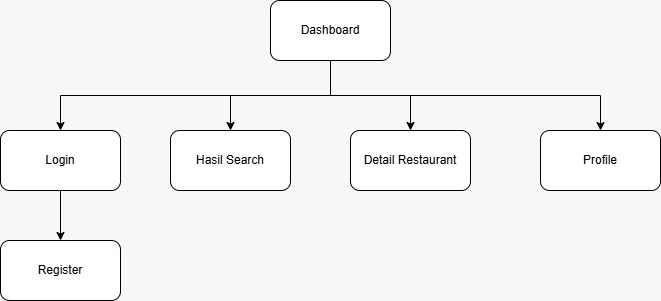

## 5. Bukti Responsivitas & Tampilan

### 5.1 Dashboard

**Mobile**

**Tablet**
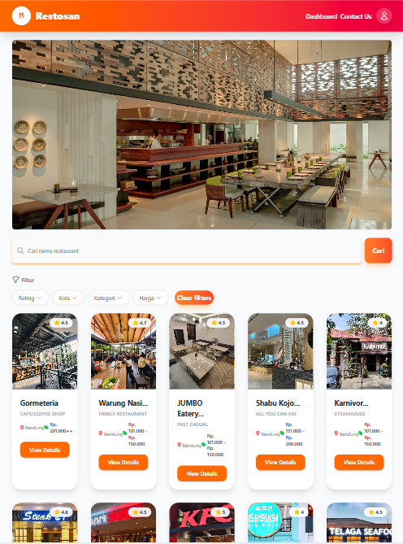
**Desktop**
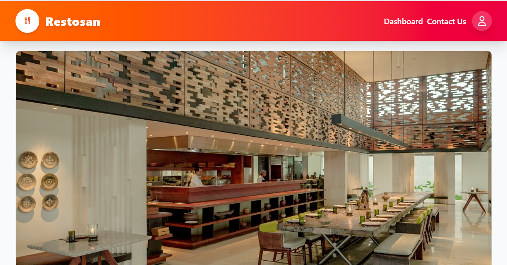

### 5.2 Detail Restoran

**Mobile**
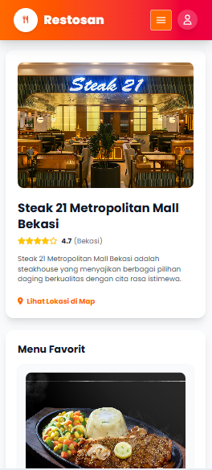
**Tablet**

**Desktop**
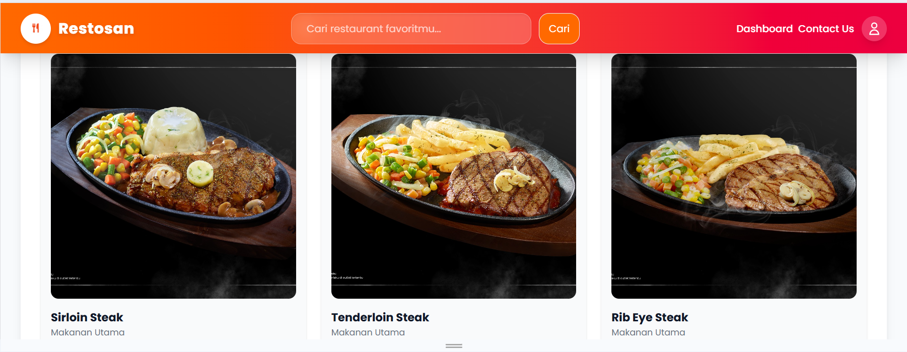

### 5.3 Hasil Pencarian

**Mobile**
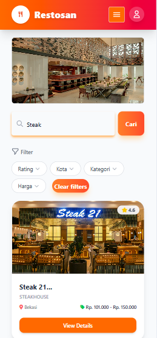
**Tablet**

**Desktop**
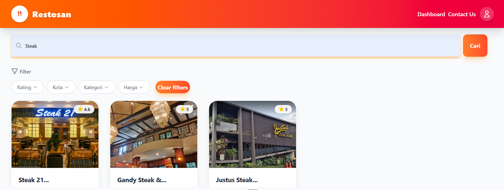

### 5.4 Login

**Mobile**
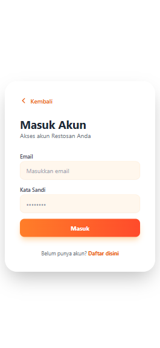
**Tablet**

**Desktop**

### 5.5 Register

**Mobile**
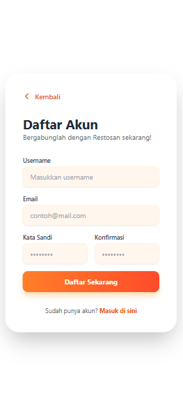
**Tablet**
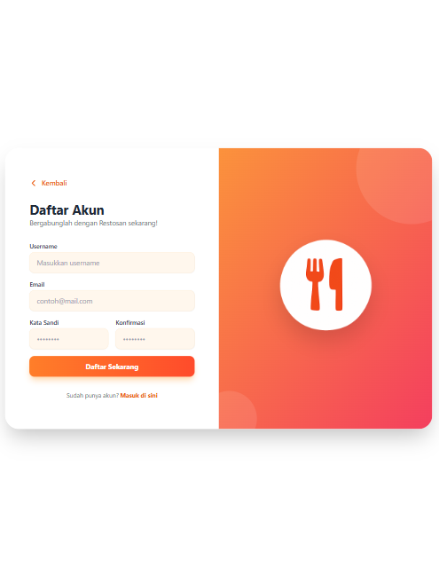
**Desktop**
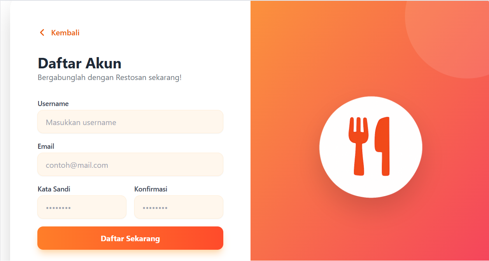

### 5.6 Profile

**Mobile**

**Tablet**
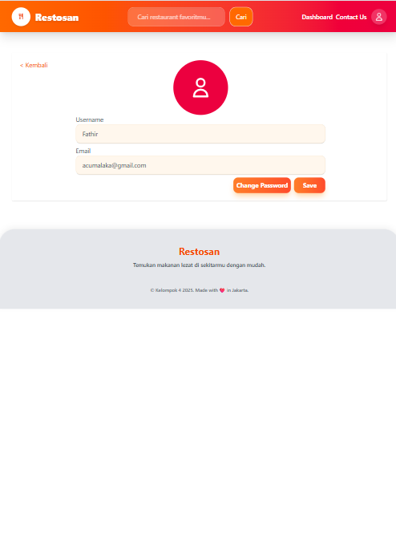
**Desktop**

## 6. Bukti Aksesibilitas
Berikut adalah hasil pengecekan aksesibilitas 

